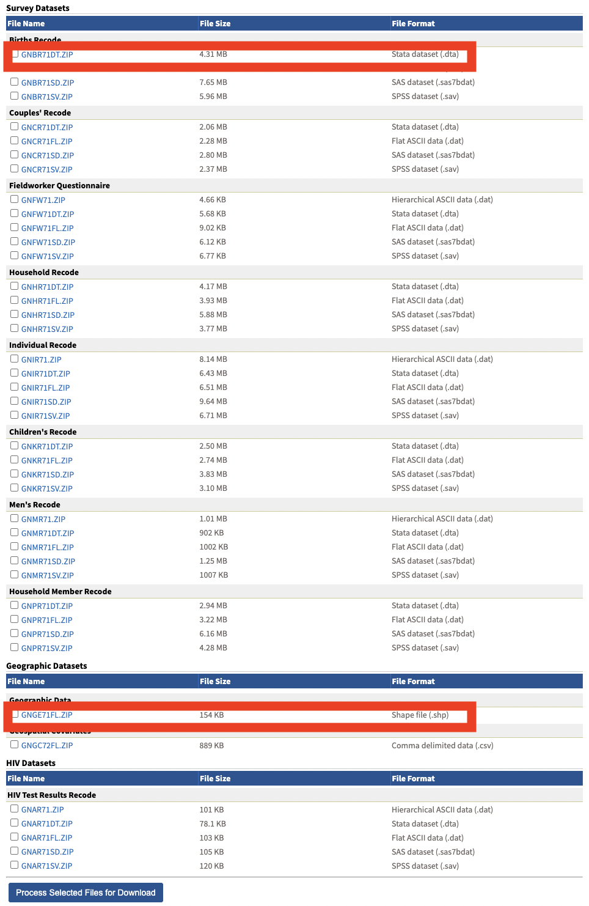

# UN Pipeline Overview

## Summary

This document provides detailed instructions for obtaining direct, smoothed direct, and urban/rural stratified Beta-binomial estimates for U5MR and NMR, as well as maps and figures of these results.

## The Data Source

Explain how to get on to CSDE, how to download what you need

## The Pipeline

#### Step 0: Prepare R

Make sure your R version is at least 4.1.0 (also RStudio is using R 4.1.0 or more recent version). Otherwise, installation of dependent packages might fail.

#### Step 1: Setting up file structure

-   Create a new directory and put the entire "Rcode" folder and the script, "create_folder.R"
-   Inside this same directory, create a folder called 'Info' and put downloaded info file in (need more instruction)
-   In RStudio, run create_folder.R. This will create the necessary file structure. *Make sure to specify the country of interest*

#### Step 2: Downloading Data

-   Put the HIV and IGME data folders from the dropbox in your newly created 'Data' folder
-   Download DHS data for country of interest from dhsprogram.com. If you haven't been given access to the DHS data, you must create an account and request access, or ask someone else in the group to download it for you. For each DHS survey, select the following files from the options menu (the file names will be slightly different depending on the country). Put the first downloaded folder in Data/<country of interest>/<survey year>/dhsStata and the second in Data/<country of interest>/<survey year>/dhsFlat.

{width="75%"}

-   If the country of interest also has MICS surveys (applicable only for Bangladesh, Madagascar, and Malawi), download the pre-processed data for that survey from the Dropbox and put in Data/<country of interest>/<survey year>

-   Finally, download the shapefiles. Note that we only need one set of files for the country of interest, not one for each survey. Check the "GADM notes" column on the country info spreadsheet (linked on github) to see if the country of interest is marked as needing 'alternative files'.

    -   If country of interest does NOT need alternative files, download the shapefile from <https://gadm.org/download_country.html> and put in Data/<country of interest>/shapeFiles.
    -   If country of interest does require alternative files, download these from the Dropbox and put in Data/<country of interest>/shapeFiles.

Before proceeding, make sure your Data/<country> folder looks similar to the following:

{width="75%"}

{width="50%"}

#### Step 3: Data Processing

Run the 'DataProcessing.R' script from the 'Rcode' folder. *Make sure to specify the country of interest at the top of the script!!*

#### Step 4: Direct Estimates

Run Direct_SmoothDirect.R. This script will calculate direct and smoothed direct NMR and U5MR estimates and generate figures. *Make sure to specify the country of interest where it is requested at the top of the script*

#### Step 5: Addressing Stratification

-   Obtain Admin-1 level urban fraction (See 'UR fraction' folder for instructions)
-   Run UR_thresholding.R to obtain urban/rural sampling weights to be used in the Beta-binomial model. *Make sure to specify the country of interest at the top of the script!!*

#### Step 6: Beta-Binomial Estimates

Run BB8.R and *Make sure to specify the country of interest at the top of the script!!*. This will fit U5MR and NMR models at the National, Admin-1, Admin-2 levels and draw benchmarked and un-benchmarked posterior estimates.
