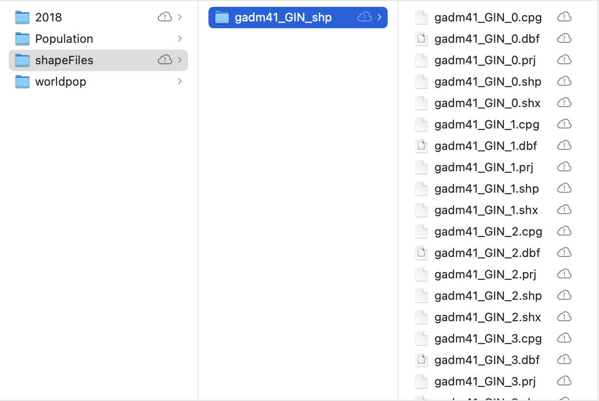
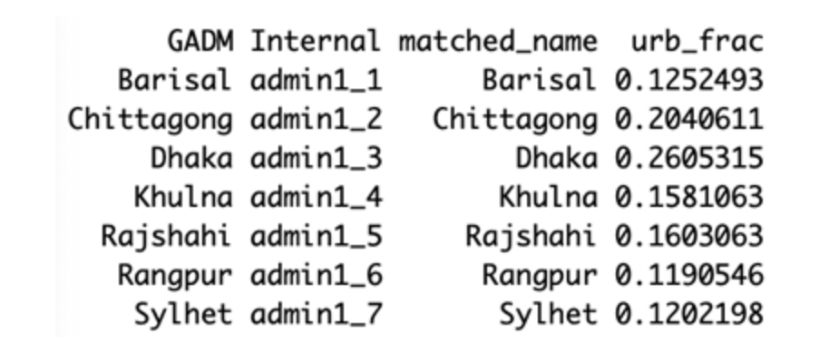

# UN Pipeline Overview

## Summary

This document provides detailed instructions for obtaining direct, smoothed direct, and urban/rural stratified Beta-binomial estimates for U5MR and NMR, as well as maps and figures of these results.

At some points in the pipeline, you will need to reference this sheet with specific information about each country:  https://docs.google.com/spreadsheets/d/1farrC3nJ0K-m35zzhZb3E7sSTGJ0iOg4ezZyhQVXt1A/edit#gid=0.  This will be referred to as the 'Country Info Sheet'. As you work through the pipeline, please update the 'Analysis' sheet.

## The Pipeline

#### Step 0: Prepare R

Make sure your R version is at least 4.1.0 (also RStudio is using R 4.1.0 or more recent version). Otherwise, installation of dependent packages might fail.

#### Step 1: Setting up file structure

-   Clone this repository on your local computer and open the 'UN-Subnational-Estimates' R project in RStudio.
-   Run create_folder.R. This will create the necessary file structure. *Make sure to specify the country of interest*

#### Step 2: Downloading shapefiles

-   Check the "GADM notes" column on the Country Info Sheet to see if the country of interest is marked as needing 'alternative files'.

    -   If country of interest does NOT need alternative files, download the shapefile from <https://gadm.org/download_country.html> and put in Data/*country of interest* and rename the folder 'shapeFiles'.
    -   If country of interest does require alternative files, you can find those in 'Data/shapeFiles_alt/*country of interest*'. Move that shapeFiles folder into Data/*country of interest*.

#### Step 3: Data Processing

Run the 'DataProcessing.R' script from the 'Rcode' folder. *Make sure to specify the country of interest at the top of the script!!*

-   In this script you will use the 'rdhs' package to download the DHS survey data.  This requires you to enter your DHS login information and project name -- if you haven't yet requested access to the DHS data, you must create an account and request access. Be sure to request access for whichever country you need and to also request access for the GPS data for that country.

#### Step 4: Direct Estimates

Run Direct_SmoothDirect.R. This script will calculate direct and smoothed direct NMR and U5MR estimates and generate figures. *Make sure to specify the country of interest where it is requested at the top of the script*

NOTE: *If the yearly smoothed direct models at the smallest admin level run without error*, we do NOT need to address stratification or fit Betabinomial models, so steps 6 and 7 should be skipped.

#### Step 5: Obtain Admin-level aggregation weights

Run Admin_Weights.R. This script will download population surfaces for each year and use them to calculate admin-level weights to use in benchmarking and plotting.  Note that downloading the population surfaces could take a signficant amount of time depending on internet connection and the size of the country.  *Make sure to specify the country of interest where it is requested at the top of the script*

#### Step 6: Addressing Stratification

-   In the Country Info Sheet, check the 'census frame' column to determine the frame year that will be used for stratification.

-   Check the 'Data/urban_frames' folder for the relevant country and frame year. If the file you need is already there, you can proceed to the next step. Otherwise, see the 'UR fraction' folder for further instructions.

-   Run the rest of ur_prop.R and make sure that the Admin-1 names in the final object, ref.tab, match up. In the end, the ref.tab object should look like the following:

-   Run UR_thresholding.R to obtain urban/rural sampling weights to be used in the Beta-binomial model. At the top of the script, make sure to specify (1) the country, (2) the frame year being used, and (3) the survey years that used this census frame (also available in the Country Info Sheet)

#### Step 7: Beta-Binomial Estimates

Run BB8.R and, again,make sure to specify (1) the country, (2) the frame year being used, and (3) the survey years that used this census frame. This will fit U5MR and NMR models at the National, Admin-1, Admin-2 levels and draw benchmarked and un-benchmarked posterior estimates.
