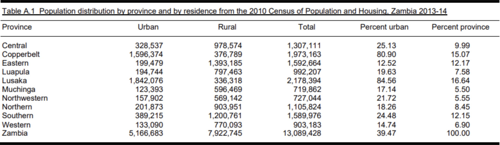
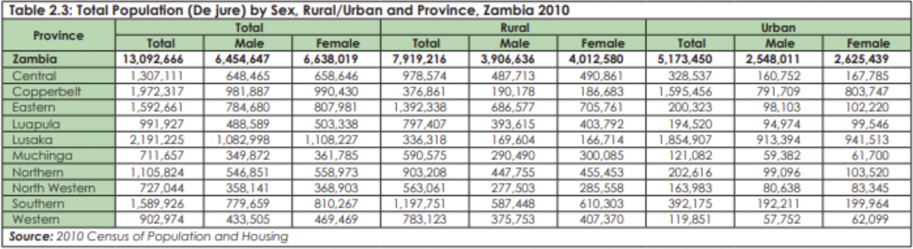
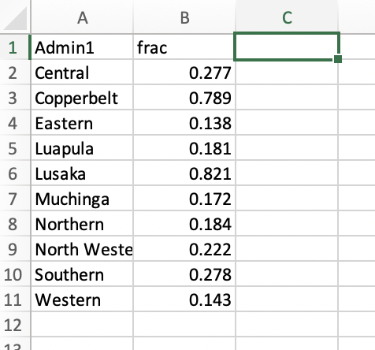

To generate urban sampling weights, we need information of urban fraction at Admin-1 level. Such information could usually be obtained with credibility from the country-specific DHS survey reports or national census reports. We need to organize this information in a cleaned table to run our scripts. 

Because these sampling weights refer to a specific sampling frame, using a stratified model requires us to only use surveys which use the same sampling frame. Thus, going forward, *we will only use the surveys that have the same sampling frame as our most recent survey*. (The removal of data that comes from surveys with a different frame is already automated in subsequent scripts). To determine which surveys this includes, you can compare frame_years with survey_years from the info file.

## 1. Search for the information about Admin-1 level urban population
It is rare that all the DHS survey reports and national census reports are formatted in the same way, which means that this information might be found at different places in different reports. We provide some general ways to find them and the options are ordered by their priority. We illustrate this process for Zambia.

a. We recommend the reader to first check out each of the DHS reports for the surveys that will be used (those that use the same sampling frame) until you find one where the admin-1 level urban population fraction is available. You can find these reports at https://dhsprogram.com/pubs. Ideally, this information will appear in Appendix A in at least 1 of the DHS reports.  For Zambia, we found the information in Table A.1 of the 2013-2014 DHS survey.

b. Sometimes, however, the admin-1 level urban population fraction is not available, and we only have the household urban fraction. If this is the case, you can check the census from the frame year of the surveys being used (again you can find this year by checking frame_years). The frame year for the Zambia surveys is 2010 so you can google 'Zambia 2010 census' to find the census report. In this case, we found the following table.

c. It is possible that the exact numbers or fractions of Admin-1 level urban population cannot be found in either DHS or census report. In this case, we can weight the Admin-1 level urban and rural households by the urban and rural averaged household sizes. This approach is not ideal because averaged household sizes are usually only available at national level and rounding will further compromise the accuracy. Generally we can find this information in Appendix A of the DHS report (any of the applicable DHS reports will suffice). *Note that if this approach is used the total number of urban and rural households must be multiplied by the average number of households in urban and rural areas, respectively.* This information can also be found in the DHS report.

## 2. Organize the information into a clean table

a. Open up ur_prop.R in from the Rcode folder and run the code up to line 35, making sure to enter in the country of interest.

b. Copy the information obtained in Step 1 into an excel file called `(country abbreviation)_frame_urb_prop.xlsx' and save in the newly created 'UR' subfolder within the Results folder. The first column of the excel file should be the name of the Admin-1 area and the second column should be the urban fraction (urban population/total population). Recall that if you are using number of households, you must multiply average household size. The excel file should look like the following:

{width=50%}

c. Run the rest of ur_prop.R and make sure that the Admin-1 names in the final object, ref.tab, match up. In the end, the ref.tab object should look like the following:

{width=50%}
